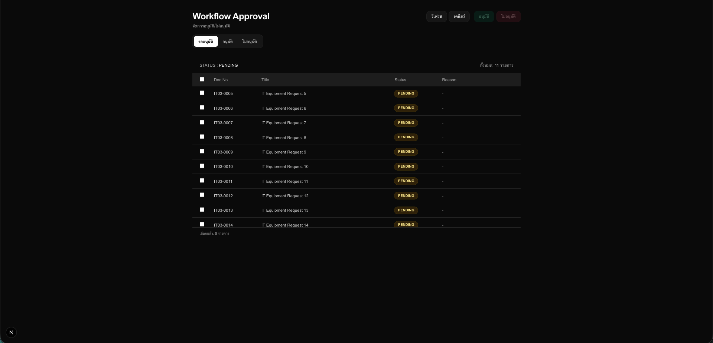
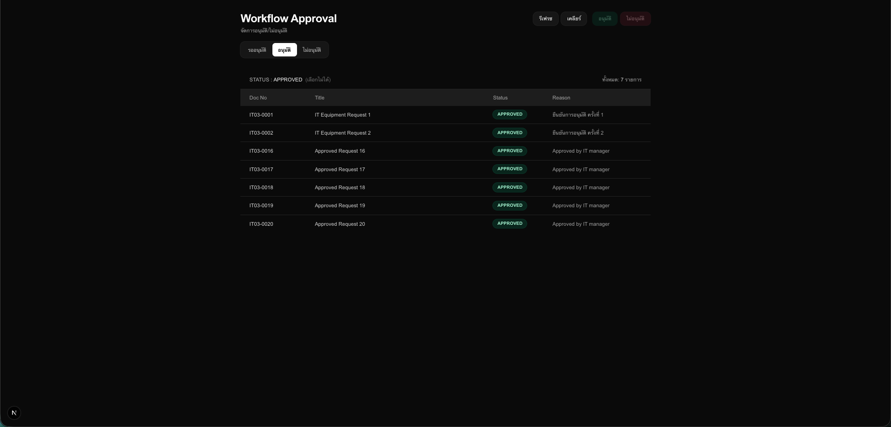
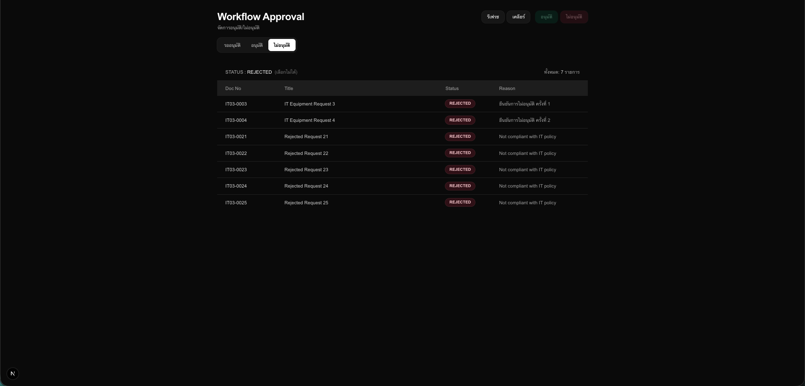
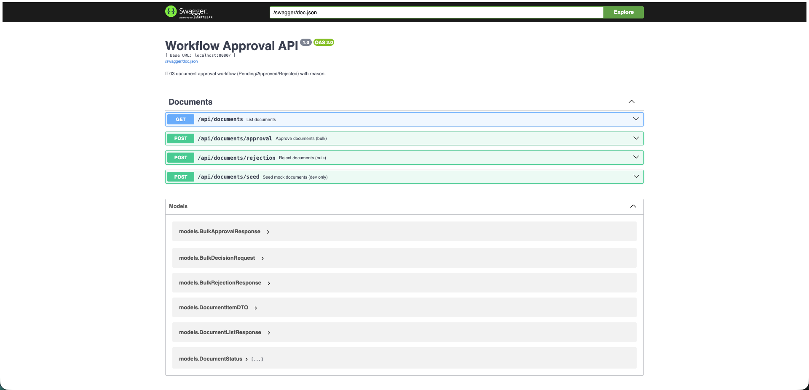

# 📄 Workflow Approval API (IT03)

Backend API สำหรับระบบอนุมัติเอกสาร IT03  
พัฒนาโดยใช้ **Golang (Fiber)** + **MongoDB**

รองรับสถานะเอกสาร:
- `PENDING`
- `APPROVED`
- `REJECTED`

---

## 🚀 Tech Stack

- Golang
- Fiber v2
- MongoDB
- Swagger (OpenAPI)

---

## 📦 Project Structure

```text
backend/
│
├── db/
│   └── mongo.go                # MongoDB connection
│
├── docs/                       # Swagger generated files
│   ├── docs.go
│   ├── swagger.json
│   └── swagger.yaml
│
├── handlers/
│   └── document_handler.go     # Business logic (approve/reject/list/seed)
│
├── models/
│   └── document.go             # Models + DTOs
│
├── routes/
│   └── routes.go               # Route registration
│
├── .env
├── main.go
├── go.mod
└── go.sum


---

## ⚙️ Setup & Run

### 1️⃣ Install dependencies

```bash
go mod tidy
```

### 2️⃣ Run Server

- go run main.go
- Server จะรันที่ : http://localhost:8080

### 📘 Swagger UI

- http://localhost:8080/swagger/index.html

## 📚 API Endpoints

- GET    /api/documents
- POST   /api/documents/approval
- POST   /api/documents/rejection
- POST   /api/documents/seed


# 🖥️ Workflow Approval UI (IT03)

Front-end สำหรับระบบอนุมัติเอกสาร IT03  
พัฒนาโดยใช้ **Next.js (App Router)** + **TypeScript** + **Tailwind CSS**

รองรับการใช้งานหลัก:
- แสดงรายการเอกสาร (แยกตามสถานะ `PENDING / APPROVED / REJECTED`)
- เลือกรายการเฉพาะ `PENDING` เพื่อทำ Bulk Action
- อนุมัติ / ไม่อนุมัติ พร้อมกรอกเหตุผลผ่าน Modal
- รีเฟรชข้อมูล และเคลียร์การเลือก

---

## 🚀 Tech Stack

- Next.js (App Router)
- React + TypeScript
- Tailwind CSS
- Fetch API (เชื่อมต่อกับ Backend)

---

## 📦 Project Structure

```text
frontend/
│
├── app/
│   ├── globals.css
│   ├── layout.tsx
│   └── page.tsx
│
├── components/
│   ├── ApprovalModal.tsx
│   └── DocumentTable.tsx
│
├── services/
│   └── api.ts
│
├── public/
│   └── screenshots/
│
├── next.config.ts
├── package.json
└── tsconfig.json

---

## ⚙️ Setup & Run

### 1️⃣ Install dependencies

```bash
npm install
```

### 2️⃣ Run Dev Server
```bash
npm run dev
```

## 🖼 UI Preview

### 📌 Pending (รออนุมัติ)



---

### ✅ Approved (อนุมัติแล้ว)



---

### ❌ Rejected (ไม่อนุมัติ)



---

### 🖌️ API



---


